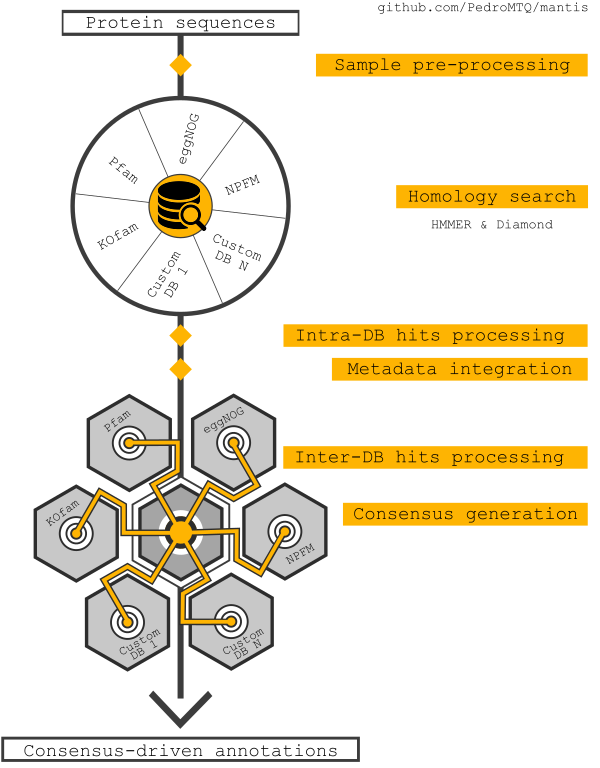

# MANTIS


This tool can be used for protein function annotation, it is a standalone tool that uses HMMER or Diamond to match sequences against multiple reference datasets. It accepts as input an aminoacids sequence fasta.  
The main goals of this tool are to:
- consider multiple protein domains
- annotate with taxonomy resolution
- use different reference datasets and provide a consensus annotation
- be easy to setup and customize
- scale well with multiple samples and/or metagenomes

If you have only loose reads, you need to assemble them first; when you have assembled reads/genomes you need to predict the protein coding regions (gene prediction - e.g. prodigal) to convert your data into a protein fasta that Mantis can then use.

**Mantis is compatible with genomes and metagenomes.**

- [Requirements](#requirements)
- [Quick configuration](#quick-configuration)
- [Functions](#functions)
- [Further details](#further-details)

# Citation
If you use Mantis, please make sure you cite the respective paper https://doi.org/10.1093/gigascience/giab042


# Workflow overview



# Straight to the point
### Requirements

- **Python**, tested with v3.7.3 but anything above v3 should be fine
- **requests**, tested with v2.22.0
- **numpy**, tested with v1.18.1
- **nltk**, tested with v3.4.4
- **sqlite**, tested with v3.30.1
- **psutil**, tested with 5.6.7
- [HMMER](#10-references-and-acknowledgements), tested with v3.2.1
- **GCC**, for compilation of cython code (most systems should have it by default)

**Mantis can only run on Linux-based systems**  


### Quick configuration
1. `git clone git@github.com:PedroMTQ/mantis.git`  
2. Go to cloned mantis folder and run `conda env create -f mantis_env.yml`
3. Run `conda activate mantis_env`
4. Go up one folder and run `python mantis setup_databases`
5. Run `python mantis run_mantis -t target_faa`


**Custom references**  

Custom references can be added in **MANTIS.config** by adding their absolute path or folder path, for example:

        custom_ref=/path/to/ref_folder/file.hmm
        custom_ref=/path/to/ref_folder/file.dmnd
        custom_ref=/path/to/ref_folder/

Alternatively you may add them to the **custom_refs** folder, for example:

        Mantis/References/Custom_references/custom1/custom1.hmm
        Mantis/References/Custom_references/custom2/custom2.dmnd

You may also redifine the **custom_refs** folder path by adding your preferred path to `custom_refs_folder` in the **MANTIS.config** file, for example:

        custom_refs_folder=path/to/custom_refs/


### Functions

**1. Help**  
````
python  mantis/  -h
````
**2. Setup databases**  
````
python  mantis/  setup_databases
````

**3. Check installation**  
````
python  mantis/  check_installation
````
**4. Merge HMM folder**  
````
python  mantis/  merge_hmm_folder -t target
````
**5. Annotate one sample**  
````
python mantis/ run_mantis -t target.faa -o output_folder-od organism_details -et evalue_threshold -ov overlap_value -mc custom_MANTIS.config    
````
*example*: `python mantis run_mantis -t mantis/tests/test_sample.faa -od "Escherichia coli"`

**6. Annotate multiple samples**  
````
python mantis/ run_mantis -t target.tsv -o output_folder -et evalue_threshold -ov overlap_value -mc custom_MANTIS.config
````
*example*: `python mantis run_mantis -t mantis/tests/test_file.tsv`

### Output files  

There are 3 output files:
 - `output_annotation.tsv`, which has all hits and their coordinates and e-values;
 - `integrated_annotation.tsv` which has all hits, their coordinates and e-value, as well as the respective hit metadata;
- `consensus_annotation.tsv` which has all hits and their respective metadata from the best reference sources consensus.  

The first two files can have the same query sequence in several lines (query sequence/reference source) while the `consensus_annotation.tsv` will only have one line per query sequence (consensus/query).

Mantis can additionally output in gff format and also a kegg module matrix completeness. Please see [Output](https://github.com/PedroMTQ/mantis/wiki/Output) for more details.

# Further details

* [Configuration](https://github.com/PedroMTQ/mantis/wiki/Configuration)  
  * [Requirements](https://github.com/PedroMTQ/mantis/wiki/Configuration#requirements)  
  * [Installation](https://github.com/PedroMTQ/mantis/wiki/Configuration#installation)  
  * [Conda environment](https://github.com/PedroMTQ/mantis/wiki/Configuration#conda-environment)  
  * [Setting your own paths](https://github.com/PedroMTQ/mantis/wiki/Configuration#setting-your-own-paths)  
  * [Custom References](https://github.com/PedroMTQ/mantis/wiki/Configuration#custom-references)  
  * [Setting references weight](https://github.com/PedroMTQ/mantis/wiki/Configuration#setting-references-weight)  
* [Functionalities](https://github.com/PedroMTQ/mantis/wiki/Functionalities)  
  * [Setup databases](https://github.com/PedroMTQ/mantis/wiki/Functionalities#setup-databases)  
  * [Check installation](https://github.com/PedroMTQ/mantis/wiki/Functionalities#check-installation)  
  * [Merge HMM folder](https://github.com/PedroMTQ/mantis/wiki/Functionalities#merge-hmm-folder)  
  * [Annotating one sample](https://github.com/PedroMTQ/mantis/wiki/Functionalities#annotate-one-sample)  
  * [Annotating multiple samples](https://github.com/PedroMTQ/mantis/wiki/Functionalities#annotate-multiple-samples)  
  * [Annotating Metagenomes](https://github.com/PedroMTQ/mantis/wiki/Functionalities#annotating-metagenomes)   
* [Output](https://github.com/PedroMTQ/mantis/wiki/Output)  
* [Additional information](https://github.com/PedroMTQ/mantis/wiki/Additional-information)  
  * [Reference data](https://github.com/PedroMTQ/mantis/wiki/Additional-information#reference-data)  
  * [What is the default e-value?](https://github.com/PedroMTQ/mantis/wiki/Additional-information#what-is-the-e-value-threshold)  
  * [Intra-reference hit processing](https://github.com/PedroMTQ/mantis/wiki/Additional-information#intra-reference-hit-processing)  
  * [Inter-reference hit processing](https://github.com/PedroMTQ/mantis/wiki/Additional-information#inter-reference-hit-processing)  
  * [A note on efficiency](https://github.com/PedroMTQ/mantis/wiki/Additional-information#notes-on-efficiency)  
* [Project structure and architecture](https://github.com/PedroMTQ/mantis/wiki/Project-structure-and-architecture)  
* [Copyright](https://github.com/PedroMTQ/mantis/wiki/Copyright)  


# License and copyright

This project is available under the [MIT license](https://github.com/PedroMTQ/mantis/wiki/Copyright).

# References and acknowledgements

> Queirós, Pedro, Novikova, Polina, Wilmes, Paul and May, Patrick. "Unification of functional annotation descriptions using text mining" Biological Chemistry, vol. , no. , 2021. https://doi.org/10.1515/hsz-2021-0125
>
> S. R. Eddy. HMMER: biosequence analysis using profile hidden Markov models. HMMER v.3.2.1 www.hmmer.org
>
> eggNOG 5.0: a hierarchical, functionally and phylogenetically annotated orthology resource based on 5090 organisms and 2502 viruses. Jaime Huerta-Cepas, Damian Szklarczyk, Davide Heller, Ana Hernández-Plaza, Sofia K Forslund, Helen Cook, Daniel R Mende, Ivica Letunic, Thomas Rattei, Lars J Jensen, Christian von Mering, Peer Bork Nucleic Acids Res. 2019 Jan 8; 47(Database issue): D309–D314. https://doi.org/10.1093/nar/gky1085
>
> The Pfam protein families database in 2019: S. El-Gebali, J. Mistry, A. Bateman, S.R. Eddy, A. Luciani, S.C. Potter, M. Qureshi, L.J. Richardson, G.A. Salazar, A. Smart, E.L.L. Sonnhammer, L. Hirsh, L. Paladin, D. Piovesan, S.C.E. Tosatto, R.D. Finn Nucleic Acids Research (2019)  https://doi.org/10.1093/nar/gky995
>
> Aramaki T., Blanc-Mathieu R., Endo H., Ohkubo K., Kanehisa M., Goto S., Ogata H. KofamKOALA: KEGG ortholog assignment based on profile HMM and adaptive score threshold. Bioinformatics. 2019 Nov 19. pii: btz859. https://doi.org/10.1093/bioinformatics/btz859.
>
> Lu S, Wang J, Chitsaz F, Derbyshire MK, Geer RC, Gonzales NR, Gwadz M, Hurwitz DI, Marchler GH, Song JS, Thanki N, Yamashita RA, Yang M, Zhang D, Zheng C, Lanczycki CJ, Marchler-Bauer A. CDD/SPARCLE: the conserved domain database in 2020. Nucleic Acids Res. 2020 Jan 8;48(D1):D265-D268. doi: 10.1093/nar/gkz991. PMID: 31777944; PMCID: PMC6943070.
>
> Fast genome-wide functional annotation through orthology assignment by eggNOG-mapper. Jaime Huerta-Cepas, Kristoffer Forslund, Luis Pedro Coelho, Damian Szklarczyk, Lars Juhl Jensen, Christian von Mering and Peer Bork. Mol Biol Evol (2017). [doi:10.1093/molbev/msx148](https://doi.org/10.1093/molbev/msx148)
>
> Saier MH, Reddy VS, Moreno-Hagelsieb G, Hendargo KJ, Zhang Y, Iddamsetty V, Lam KJK, Tian N, Russum S, Wang J, Medrano-Soto A. The Transporter Classification Database (TCDB): 2021 update. Nucleic Acids Res. 2021 Jan 8;49(D1):D461-D467. doi: 10.1093/nar/gkaa1004. PMID: 33170213; PMCID: PMC7778945.
